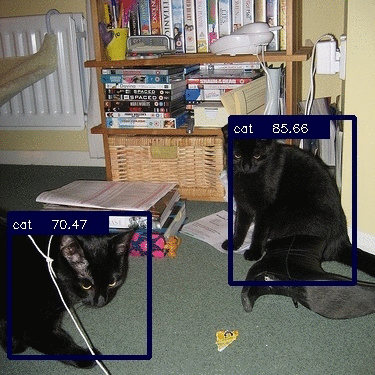

# YOLO_v1 Pytorch
---

Pytorch Implementation of [YOLO-v1](https://arxiv.org/1506.02640)

- [x] Implementing YOLO_v1
- [x] Training on VOC2012 dataset 
- [ ] Check Data Distribution and re-train
  

### Evaluate result
| Class |  AP | Class |  AP |
| ----- | --- | ----- | --- |
| Aeroplane | 0.60619 | Bicycle | 0.47130 |
| Bird | 0.55775 | Boat | 0.38349 |
| Bottle | 0.18921 | Bus | 0.58153 |
| Car | 0.58516 | Cat | 0.82333 |
| Chair | 0.28463 | Cow | 0.41928 |
| Diningtable | 0.48143 | Dog | 0.70814 |
| Horse | 0.57312 | Motorbike | 0.49198 |
| Person | 0.55924 | Pottedplant | 0.16912 |
| Sheep | 0.49356 | Sofa | 0.47690 |
| Train | 0.74119 | Tv-monitor | 0.48420 |
| **Total mAp** | 0.50404 |
- It seems cannot really detect small objects such as bottle and pottedplany, etc.
- Guess need to check data distribution

  

### Some Detection Example from VOC2007
